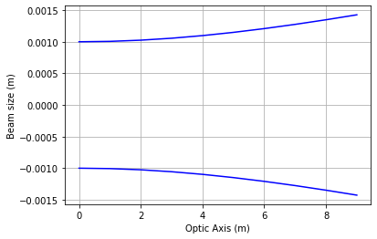
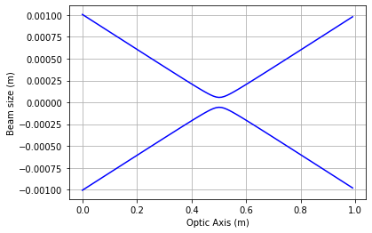
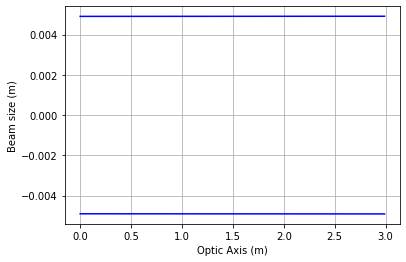

# Gaussian Beam Propagation

## Import files


```python
import BeamProp_Script as bs      # This is the script that handles the propagation
import sympy as sym               # For Symbolic examples
import numpy as np                # Handling of lists and for plotting
import matplotlib.pyplot as plt   # Plotting
```

### Let's show what BeamProp_Script has


```python
help(bs)
```

    Help on module BeamProp_Script:
    
    NAME
        BeamProp_Script - Created on Wed Feb 19 15:51:54 2020
    
    DESCRIPTION
        @author: wrighta
    
    FUNCTIONS
        W0(zr, lam)
            Parameters
            ----------
            zr : float, integer, symbol
                Rayleigh range in meters
            lam : float, integer, symbol
                Wavelength of light in meters
            
            Returns
            -------
            w0 : float, integer, symbol
                Beam waist radius in meters
        
        Zr(wo, lam)
            Parameters
            ----------
            wo : float, integer, or symbol
                Beam waist radius in meters.
            lam : float, integer, or symbol
                Wavelength of light in meters.
            
            Returns
            -------
            zr : float, int, symbols
                Rayleigh range for given beam waist and wavelength.
        
        lens(f)
            Parameters
            ----------
            f : float or integer or sympy symbol in meters
                Thin lens focal length in meters
            
            Returns
            -------
            mat : 2x2 matrix
            [
            [   1, 0],
            [-1/f, 1]
            ]
        
        mult(mat1, *argv)
            Parameters
            ----------
            mat1 : 2x2 ABCD matrix
                Last matrix light interacts with.
            *argv : 2x2 ABCD matrices 
                From left to right, the matrices should be entered such that the leftmost matrix interacts
                with light temporally after the rightmost matrix.
            
            Returns
            -------
            Mat : 2x2 matrix
                The ABCd matrix describing the whole optical system.
        
        plot(func, var, rang=array([0.  , 0.01, 0.02, 0.03, 0.04, 0.05, 0.06, 0.07, 0.08, 0.09, 0.1 ,
               0.11, 0.12, 0.13, 0.14, 0.15, 0.16, 0.17, 0.18, 0.19, 0.2 , 0.21,
               0.22, 0.23, 0.24, 0.25, 0.26, 0.27, 0.28, 0.29, 0.3 , 0.31, 0.32,
               0.33, 0.34, 0.35, 0.36, 0.37, 0.38, 0.39, 0.4 , 0.41, 0.42, 0.43,
               0.44, 0.45, 0.46, 0.47, 0.48, 0.49, 0.5 , 0.51, 0.52, 0.53, 0.54,
               0.55, 0.56, 0.57, 0.58, 0.59, 0.6 , 0.61, 0.62, 0.63, 0.64, 0.65,
               0.66, 0.67, 0.68, 0.69, 0.7 , 0.71, 0.72, 0.73, 0.74, 0.75, 0.76,
               0.77, 0.78, 0.79, 0.8 , 0.81, 0.82, 0.83, 0.84, 0.85, 0.86, 0.87,
               0.88, 0.89, 0.9 , 0.91, 0.92, 0.93, 0.94, 0.95, 0.96, 0.97, 0.98,
               0.99, 1.  , 1.01, 1.02, 1.03, 1.04, 1.05, 1.06, 1.07, 1.08, 1.09,
               1.1 , 1.11, 1.12, 1.13, 1.14, 1.15, 1.16, 1.17, 1.18, 1.19, 1.2 ,
               1.21, 1.22, 1.23, 1.24, 1.25, 1.26, 1.27, 1.28, 1.29, 1.3 , 1.31,
               1.32, 1.33, 1.34, 1.35, 1.36, 1.37, 1.38, 1.39, 1.4 , 1.41, 1.42,
               1.43, 1.44, 1.45, 1.46, 1.47, 1.48, 1.49, 1.5 , 1.51, 1.52, 1.53,
               1.54, 1.55, 1.56, 1.57, 1.58, 1.59, 1.6 , 1.61, 1.62, 1.63, 1.64,
               1.65, 1.66, 1.67, 1.68, 1.69, 1.7 , 1.71, 1.72, 1.73, 1.74, 1.75,
               1.76, 1.77, 1.78, 1.79, 1.8 , 1.81, 1.82, 1.83, 1.84, 1.85, 1.86,
               1.87, 1.88, 1.89, 1.9 , 1.91, 1.92, 1.93, 1.94, 1.95, 1.96, 1.97,
               1.98, 1.99, 2.  , 2.01, 2.02, 2.03, 2.04, 2.05, 2.06, 2.07, 2.08,
               2.09, 2.1 , 2.11, 2.12, 2.13, 2.14, 2.15, 2.16, 2.17, 2.18, 2.19,
               2.2 , 2.21, 2.22, 2.23, 2.24, 2.25, 2.26, 2.27, 2.28, 2.29, 2.3 ,
               2.31, 2.32, 2.33, 2.34, 2.35, 2.36, 2.37, 2.38, 2.39, 2.4 , 2.41,
               2.42, 2.43, 2.44, 2.45, 2.46, 2.47, 2.48, 2.49, 2.5 , 2.51, 2.52,
               2.53, 2.54, 2.55, 2.56, 2.57, 2.58, 2.59, 2.6 , 2.61, 2.62, 2.63,
               2.64, 2.65, 2.66, 2.67, 2.68, 2.69, 2.7 , 2.71, 2.72, 2.73, 2.74,
               2.75, 2.76, 2.77, 2.78, 2.79, 2.8 , 2.81, 2.82, 2.83, 2.84, 2.85,
               2.86, 2.87, 2.88, 2.89, 2.9 , 2.91, 2.92, 2.93, 2.94, 2.95, 2.96,
               2.97, 2.98, 2.99]))
            Parameters
            ----------
            func : Sympy function of one variable
                Sympy function defining the beam width after the last optical element.
            var : sympy variable
                Variable in func that will be plotted.
            rang : numpy array
                Array of the values along the optical axis to be plotted
            
            Returns
            -------
            plot : matplotlib graph
                Graph of the beam width of var
        
        prop(d)
            Parameters
            ----------
            d : float or integer or sympy symbol
                Distance light is propagating along the z-axis.
            
            Returns
            -------
            mat: 2x2 matrix
            [
            [1, d],
            [0, 1]
            ]
        
        q1_func(z, w0, lam, mat)
            Parameters
            ----------
            z : float, int, symbol
                Position of the beam waist in meters.
            w0 : float, int, symbol
                Radial waist size in meters (of the embedded Gaussian, i.e. W0/M).
            lam : float, int, symbol
                Wavelength of light in meters.
            mat : float, int, symbol
                The ABCD 2x2 matrix describing the optical system.
            
            Returns
            -------
            z: float, int, symbol
                Position of the beam waist after the optical system
            zr: float, int, symbol
                Rayleigh range of the beam after the optical system
        
        q1_inv_func(z, w0, lam, mat)
            Parameters
            ----------
            z : float, int, symbol
                Position of the beam waist in meters.
            w0 : float, int, symbol
                Radial waist size in meters (of the embedded Gaussian, i.e. W0/M).
            lam : float, int, symbol
                Wavelength of light in meters.
            mat : float, int, symbol
                The ABCD 2x2 matrix describing the optical system.
            
            Returns
            -------
            R : float, int, symbol
                Radius of curvature of the wavefront in meters.
            w : float, int, symbol
                Radius of the beam in meters.
        
        ray(y, theta)
            Parameters
            ----------
            y : float or integer or sympy symbol in meters
                The vertical height of a ray.
            theta : float or integer in radians
                The angle of divergence of the ray.
            
            Returns
            -------
            mat : 2x1 matrix
                [
                [y],
                [teta]
                ]
    
    DATA
        oo = oo
    
    FILE
        c:\users\wrighta\documents\beamprop\beamprop_script.py
    
    
    

## Let's first see how we define a beam and how we can visualize it propagating.

### A Gaussian beam can be defined by it's (radial) waist, $w_0$, it's Rayleigh range, $z_R = \frac{\pi * w_0^2}{\lambda}$, and the location of its waist, $z_0$.


```python
w0 = 1E-3 # 1mm beam waist
lam = 355E-9 # wavelength of 355 nm (UV)
zR = bs.Zr(w0, lam) # Rayleigh range in m
z0 = 0 # location of waist in m
```

### We now want to define our "optical system" using matrices. For this first example, we will just use a free space propagation matrix, and let the beam propagate a distance $d$ which we will define using a symbol.


```python
d = sym.symbols('d')
M = bs.prop(d)
```

### We now use the bs script to do all the ABCD and q-parameter math, and return the waist and radius of curvature functions


```python
R, w = bs.q1_inv_func(0, w0, lam, M)
```


```python
print('w = {}'.format(w))
```

    w = 0.001*(0.0127690021685256*d**2 + 1)**0.5
    

### And as simple as that, we have a function for our waist. Let's plot it and see what it looks like


```python
bs.plot(w, d, rang = np.arange(0,10))
```





### Let's show what happens when a beam travels through a lens. We use the "mult" function to multiply multiple ABCD matrices together.


```python
w0 = 1E-3 # 1mm beam waist
lam = 355E-9 # wavelength of 355 nm (UV)
zR = bs.Zr(w0, lam) # Rayleigh range in m
z0 = 0 # location of waist in m

d = sym.symbols('d')
M = bs.mult(bs.prop(d), bs.lens(.5), bs.prop(1))
            
R, w = bs.q1_inv_func(0, w0, lam, M)

bs.plot(w, d, rang = np.arange(0,1,.01))
```





### Lets look at how to expand and collimate a beam with a two lens system


```python
w0 = 1E-3 # 1mm beam waist
lam = 355E-9 # wavelength of 355 nm (UV)
zR = bs.Zr(w0, lam) # Rayleigh range in m
z0 = 0 # location of waist in m

d1, d2, d3, f1, f2 = sym.symbols('d1 d2 d3 f1 f2')

M = bs.mult(bs.prop(d3),bs.lens(f2),bs.prop(d2), bs.lens(f1), bs.prop(d1))

R, w = bs.q1_inv_func(0, w0, lam, M)
```

### For example, lets say the beam travels 1 m before hitting the first lens, and we want the beam to be 5x w0 after coming out of the second lens. We substitute d1 for 1 meter, since the beam propagates 1 meter, and we substitute d3 for 0, since we only care about the beam size right at the second lens. This gives us a relation between f1 and d2 (the separation between the lenses).


```python
w = w.subs(d1,1).subs(d3,0)
f1_eq = sym.solve(w - 5*w0, f1)[0]
print('f = {}'.format(f1_eq))
```

    f = 1.0084642216545e+15*d2*(1.12051580183833e+27*d2 - 4.41556446152598e+29*sqrt(1 - 0.000504320418227052*d2**2) + 8.88733242867719e+28)/(1.13000009595246e+42*d2**2 + 2.26000019190491e+42*d2 - 2.12276362486616e+45)
    

#### Suppose we wanted the distance between the lenses to be 1 meter, we could find what f1 we need.


```python
print('f1 = {:.2f} m, for a lens separation of 1 meter'.format(f1_eq.subs(d2, 1)))
```

    f1 = 0.17 m, for a lens separation of 1 meter
    

### Now we need to collimate the beam. Lets still assume the beam propagates 1 m, and f1 = .17 m.

There are a couple different ways to think about collimation. One is that the beam size doesn't change over a long distance. The other is that the radius of curvature is infinite (i.e. a plane wave). Lets us the latter interpretation. Thus, we want to find the focal length f2 that makes R infinite, or that makes 1/R =0.


```python
R_coll = R.subs(d1,1).subs(d2,1).subs(f1,.17).subs(d3,0)
f2_coll = sym.solve(1/R_coll,f2)[0]
print('f2 = {:.2f}, for a collimated beam, 5x the original waist, after propagating 1m to the first lens of f1 = .17m, and propagating another 1m to the second lens'.format(f2_coll))
```

    f2 = 0.83, for a collimated beam, 5x the original waist, after propagating 1m to the first lens of f1 = .17m, and propagating another 1m to the second lens
    

### Lets plot the beam profile after the second lens, and see if it is collimated.


```python
M = bs.mult(bs.prop(d3),bs.lens(.83),bs.prop(1), bs.lens(.17), bs.prop(1))

R, w = bs.q1_inv_func(0, w0, lam, M)

bs.plot(w,d3)
```





### Looks very collimated. Lets check the beam size (to make sure its 5* w0) and check the collimation


```python
expansion_factor = w.subs(d3,0)/ w0
print('beam is w = {:.2f} x w0'.format(expansion_factor))
```

    beam is w = 4.90 x w0
    


```python
beam_size_change = (w.subs(d3,10) - w.subs(d3,0)) / w.subs(d3,0) * 100
print('Over 10 m after second lens, beam changes by {:.0f}%'.format(beam_size_change))
```

    Over 10 m after second lens, beam changes by 1%
    


```python

```
